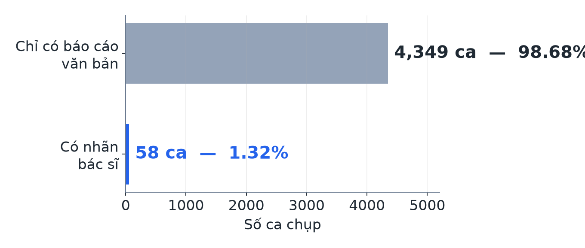
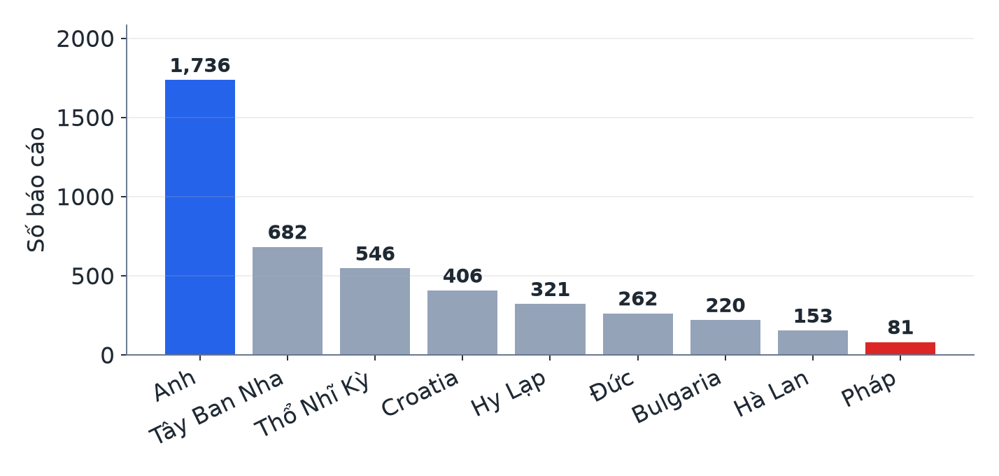
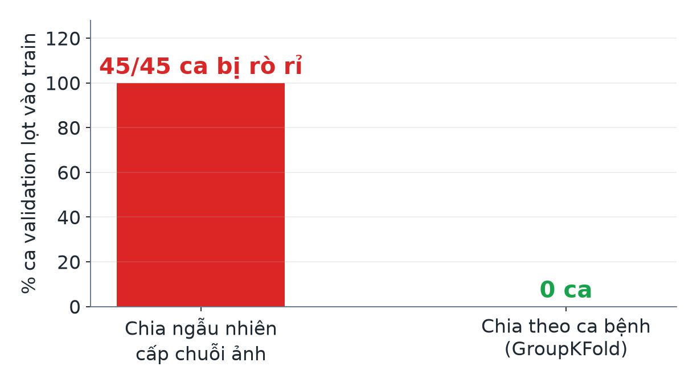
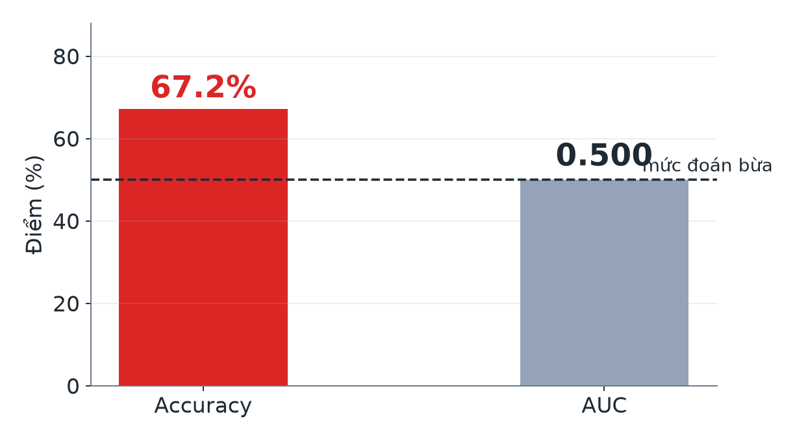
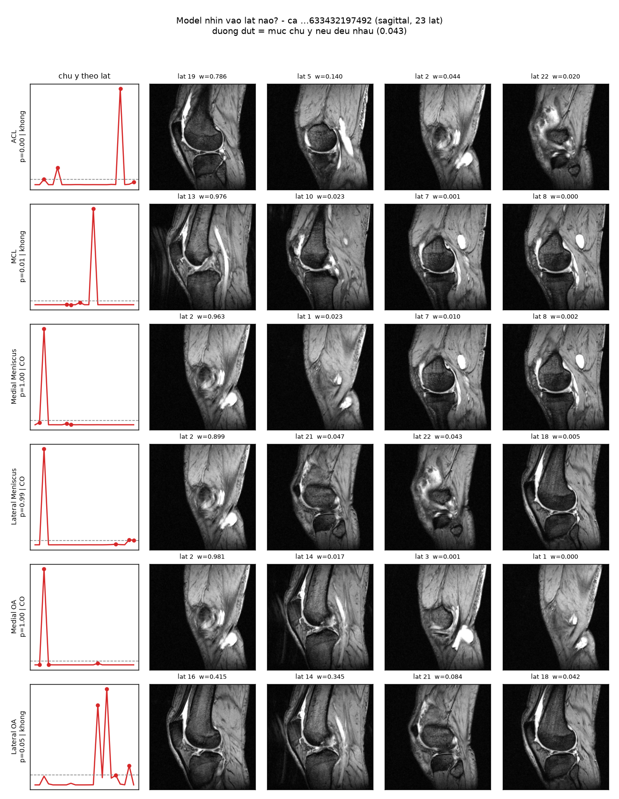
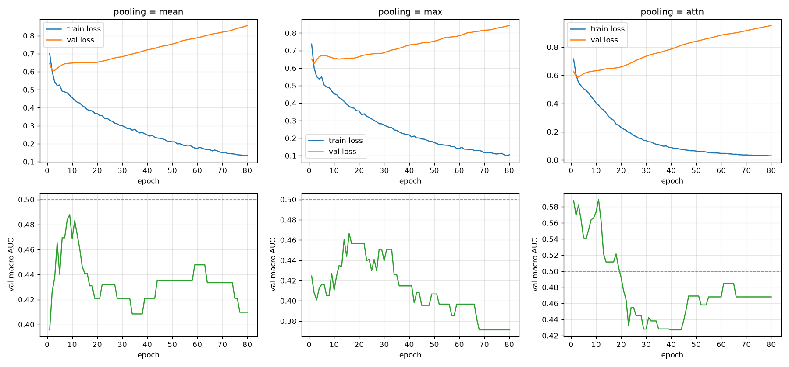

# RSNA Knee Abnormality Detection

Predicting 12 knee abnormalities from multi-plane MRI when **only 1.3% of studies carry human labels**. [Competition](https://www.kaggle.com/competitions/rsna-knee-abnormality-detection) · 4,420 teams · deadline 2026-10-22.

Full pipeline built from raw DICOM to submission. No other competitor's fine-tuned checkpoints were used.

*[Bản tiếng Việt →](README.vi.md)*

---

## Results

| | Macro AUC (CV) | Kaggle public LB |
|---|---:|---:|
| Constant baseline | 0.500 | — |
| Frozen DINOv2, 58 studies, 1 plane | 0.5256 | — |
| **Submission 1** | 0.566 | **0.601** |
| + 3 planes (149k → 437k slices) | 0.6266 | — |
| + rule-based weak labels | 0.6923 | — |
| **Submission 2** | 0.6923 | **0.695** |
| + LLM labels replacing rule-based | 0.7467 | — |
| + per-diagnosis attention pooling | 0.7698 | — |
| **Submission 3 — 5-model ensemble** | **0.8113** | **0.771** |

### The number worth reading isn't 0.8113 — it's this table

| Submission | Own CV | True LB | Gap |
|---|---:|---:|---:|
| 1 | 0.566 | 0.601 | **+0.035** |
| 2 | 0.6923 | 0.695 | **+0.003** |
| 3 | 0.8113 | 0.771 | **−0.040** |

The first two submissions had CV **below** the true score. The third came out **above**, and flipped sign.

The evaluation protocol didn't break — **the way it was used** did. Between submissions 2 and 3, every choice was made by comparing scores **on the same 58 evaluation studies**:

| Choice | Options compared |
|---|---:|
| Label source | 3 |
| Pooling type | 4 |
| Backbone | 2 |
| Ensemble subset | 26 |
| | **~35** |

The seed-variance measurement *(section 4)* predicted both the direction and the magnitude: picking the best of **5** seeds inflates by `+0.005`. Picking across **~35** choices inflating by `+0.040` is entirely consistent.

> **Takeaway:** measure once and the estimate is unbiased; measure 35 times and take the maximum and it no longer is. The first two submissions tracked closely *precisely because almost nothing had been selected yet* — one configuration, then submit.
>
> The improvement is real: LB `0.695 → 0.771`, **+0.076**, the largest jump of the project. It's just smaller than CV promised.

---

## Why the problem is hard

- **Input:** one MRI study (5.53 series on average — sagittal / coronal / axial, ~26 DICOM slices each). 569 GB total.
- **Output:** 12 probabilities per study. Multi-label, not mutually exclusive → 12 logits + `BCEWithLogitsLoss`.
- **Metric:** macro AUC over 12 labels.
- **Only 58 of 4,407 studies (1.32%) have radiologist labels.** The other 4,349 have only a free-text `Report` — in **9 languages**.

Two consequences shaped the whole project:

1. Labels must be **extracted from text** to use the remaining 98.7% → a multilingual NLP problem sitting inside a CV problem.
2. **58 evaluation studies is a hard ceiling.** Every confidence interval is wide, and neither more images nor more weak labels narrow it — the bootstrap resamples by study.

| Label distribution | 9 languages in the reports |
|---|---|
|  |  |

| Series-level splitting leaks 100% | Why accuracy is not reported |
|---|---|
|  |  |

---

## Final architecture

```
DICOM (3 planes)
   -> percentile 1-99 normalisation ACROSS THE WHOLE SERIES  -> resize
   -> frozen DINOv2  -> per-slice features
   -> 5 independent heads, each a different view
   -> RANK average  -> 12 probabilities
```

| Component | Sees | Backbone | Own CV |
|---|---|---|---:|
| `mp_sagittal` | Sagittal only | ViT-S/14 @ 224 | 0.7106 |
| `mp_axial` | Axial only | ViT-S/14 @ 224 | 0.7691 |
| `mp_coronal` | Coronal only | ViT-S/14 @ 224 | 0.7394 |
| `chung_s224` | all 3 planes concatenated | ViT-S/14 @ 224 | 0.7698 |
| `chung_b336` | all 3 planes concatenated | ViT-B/14 @ 336 | 0.7481 |
| **Ensemble of 5** | | | **0.8113** |

**Not one of them reaches 0.78 alone.** The ensemble reaches 0.8113 because they fail on *different cases* — for instance `chung_b336` is clearly better on PF OA (+0.069) and Effusion (+0.047) but clearly worse on MCL (−0.184).

Averaging is done **over ranks, not values**: the five heads were trained separately, so their logit scales share no origin, and averaging logits would let the most "confident" head dominate. AUC only cares about ordering.

The rule is **"average everything"**, not "average the best subset". All 26 subsets were tried; taking the highest of 26 is **selection on the evaluation set**, and that inflation does not transfer to the leaderboard.

### What does the model look at?

`PerLabelAttnPool` gives each diagnosis its own attention weights over slices, so it can be drawn — the only part of the pipeline that is visible to the eye.



*Generated by `python scripts/46_ve_attention.py`. This study has 7 of 12 diagnoses positive and the model gets all 12 labels right.*

> ⚠️ **But this figure says something uncomfortable.** Measured properly, the 12 diagnoses use only **4 distinct slices**, attention entropy is **0.196** (1.0 = uniform), and **7 of 12 diagnoses collapse onto the same slice**. A medial meniscus tear and a Baker's cyst sit in entirely different parts of the joint — there is no anatomical reason for them to share a slice.
>
> This looks less like "each diagnosis attends to its own anatomy" and more like the model finding one slice that says *"this knee is abnormal"* and routing every positive prediction through it. Consistent with features predicting the scanner manufacturer at 82.8%: the signal here is **study-level**, not lesion-level.

---

## Five things found by measuring, not guessing

### 1. Two data leaks

**Splitting at series level leaks 100% of the validation set.** Measured on 336 series across the 58 gold studies: every validation study had at least one of its series on the training side. If the prediction unit is the study, the split unit must be too.

**Weak labels carry validation answers into training under a different UID.** Weak labels are derived from the report, so a non-gold study whose report is *byte-identical* to a validation study's report smuggles its answers across. Only **1 study in 4,349** was affected — but closing it moved the lower bound of the confidence interval from `+0.006` to `−0.004`, **flipping the conclusion**. The evidence had been sitting exactly one row of data from the threshold.

### 2. A public label set that copied the gold labels

```
llm_labels_v4_blend | AUC on gold 0.8927 | 0.1% of values exactly 0 or 1
report_labels_v5    | AUC on gold 1.0000 | 100% on gold, 0% off gold
```

The signal isn't "high AUC" — a genuinely good label set is also high. It's **high AUC together with values on gold being exactly 0 or 1 while values off gold are not**. The pipeline has an automatic guard that halts on this pattern.

### 3. A proven improvement is not permanent

Round 2 concluded "weak labels help": `+0.152`, CI `[+0.095, +0.216]`, clean.

Round 3 added two imaging planes → the same comparison shrank to `+0.066`, CI `[−0.004, +0.137]` — **crossing zero**. Not because weak labels got worse, but because **the baseline got better**. More images and more labels are largely *substitutes*: both fix the same root problem of 58 labelled studies.

Likewise, decomposing the gain into "label quality vs label coverage" **reverses** when the head architecture changes — something that should have nothing to do with the question being asked. The honest conclusion is: unknown.

### 4. Variance from the seed alone

Rerunning **the identical** configuration with 5 seeds, folds held fixed:

```
0.7407  0.7447  0.7340  0.7468  0.7431
mean 0.7419 | std 0.0049 | RANGE 0.0128
```

This is the yardstick for rereading every earlier conclusion. All five main results clear the noise — but the thinnest (`+0.019`, the pooling choice on day 5) clears it by only 1.5×, and it **later reversed itself**.

It also produces two numbers that are close in size but opposite in nature:

| | |
|---|---|
| Picking the best seed | `+0.0049` — does **not** transfer to the LB; it is looking at the answer and choosing |
| Averaging over seeds | `+0.0048` — **legitimate**; the answer is never consulted |

### 5. Negative results, kept

- **Fine-tuning the backbone showed no measurable gain** (`+0.009`, CI `[−0.047, +0.067]`).
- **A larger backbone at higher resolution was worse** (`−0.022`). The preceding diagnosis was right that the head was not the bottleneck; the inference that "therefore a bigger backbone will help" was wrong.
- Both are still useful — they are **different** from the frozen baseline, so they contribute to the ensemble.

---

## Scanner leakage: measured, not mitigated

Features predict the **scanner manufacturer** with **82.8%** accuracy (chance: 37.9%), and splitting by study does **not** block this tier — 17 of 17 (fold, manufacturer) pairs are mixed.

| Manufacturer | n | Macro AUC | 95% CI |
|---|---:|---:|---|
| GE | 16 | 0.7818 | `[0.700, 0.874]` |
| SIEMENS | 22 | 0.7598 | `[0.704, 0.817]` |
| PHILIPS | 18 | 0.6985 | `[0.578, 0.789]` |

The spread is `+0.083` but the intervals overlap → **not measurable**. With 16–22 studies per manufacturer this test has almost no resolving power.

**A deliberate trade-off:** grouping folds by manufacturer allows at most 4 folds, the smallest holding 2 studies, with 2 (fold, label) pairs unscoreable. At this sample size the cost exceeds the benefit — but the risk that *a private test set with a different manufacturer mix scores lower* remains untouched.

---

## Code layout

```text
src/rsna_knee/
├── config.py          # 12 labels (fixed order), paths, seed, short_uid for MAX_PATH
├── manifest.py        # study-level manifest; human/machine label provenance
├── splits.py          # StratifiedGroupKFold by study + duplicate-report merging; leak checks
├── metrics.py         # hand-written macro AUC — always reports its denominator
├── dicom_io.py        # DICOM reading, per-series percentile normalisation, resize
├── dataset.py         # StudyDataset (1 item = 1 study) + FeatureDataset
├── features.py        # frozen backbone → per-slice features
├── head.py            # slice→study pooling (mean/max/attn/per_label_attn) + masked BCE
└── reports/
    ├── lexicon.py     # 9-language lexicon: concept / finding / negation
    ├── extract.py     # 3-state label extractor: 1 / 0 / unknown
    └── evaluate.py    # scoring on the gold set, per label, per language
```

### Two architectural decisions worth stating

**`PerLabelAttnPool`** — one set of attention weights per diagnosis. The three standard pooling modes produce *one* vector shared across all 12 diagnoses, implicitly assuming "a slice that matters for one condition matters for another". That is wrong clinically: an ACL tear appears on a few mid-joint sagittal slices, an effusion on entirely different ones.

The subtle failure mode: when pooling returns `(B, L, d)`, placing `nn.Linear(d, L)` after it makes **every logit depend on all 12 pooled vectors** — diagnosis A reading diagnosis B's slice stack. The model still runs, the loss still drops, a score still appears; it is simply wrong. There is a dedicated test for exactly this.

**Planes are merged by concatenating slices, not feature vectors.** Concatenating vectors would change the head's input dimension, turning the experiment into a two-variable change (more images *and* a different model) — after which a score change cannot be attributed to either.

---

## Running it

```bash
uv venv --python 3.12 .venv
uv sync --extra data --extra dev
uv run pytest                        # 100 tests, ~30 seconds
```

Versions are **pinned in `uv.lock`**. Several documented numbers depend on the exact version — for instance `roc_auc_score` returning `nan` rather than raising is `scikit-learn 1.9.x` behaviour.

| Step | Command | Runs on |
|---|---|---|
| Manifest + splits | `python scripts/10_build_manifest.py` · `11_build_splits.py` | local |
| Weak labels from reports | `python scripts/20_extract_weak_labels.py` | local |
| **Feature extraction** | paste `scripts/06_kaggle_extract_features.py` | **Kaggle GPU** |
| Ingest features | `python scripts/07_ingest_kaggle_features.py <dir>` | local |
| Frozen head | `python scripts/31_train_frozen_head.py` | local |
| Weak-label experiment | `python scripts/40_experiment_weak_labels.py` | local |
| Label-source experiment | `python scripts/41_experiment_label_source.py` | local |
| Error analysis | `python scripts/42_error_analysis.py` | local |
| Per-plane heads | `python scripts/43_head_tung_mat_phang.py` | local |
| Seed variance | `python scripts/44_phuong_sai_seed.py` | local |
| **Train final ensemble** | `python scripts/45_train_final_ensemble.py` | local |
| Attention figure | `python scripts/46_ve_attention.py` | local |
| Pack submission assets | `python scripts/49_pack_submission_assets.py` | local |
| **Submission** | paste `scripts/50_kaggle_submit.py` | **Kaggle, internet OFF** |
| Backbone fine-tune | paste `scripts/60_kaggle_finetune.py` | **Kaggle GPU** |
| Backbone throughput probe | paste `scripts/62_kaggle_do_toc_do.py` | **Kaggle GPU** |

### Why feature extraction runs on Kaggle

Downloading ~1,500 `.dcm` files plus 4,000+ listing requests in one session gets the account rate-limited: HTTP `429`, header `retry-after: 179280` seconds ≈ **50 hours**. On Kaggle the dataset is already mounted at `/kaggle/input`, costing no API requests, with a free T4. Only the results come back (a few hundred MB instead of 569 GB).

**On Windows the competition's native paths exceed the 260-character MAX_PATH limit.** The resulting error is a `FileNotFoundError` — very easy to misdiagnose as a network problem. Local directories use the last 12 characters of the UID; the full mapping lives in `data/manifest/local_images.csv`.

---

## Tests

100 tests, no image data required. They do **not** check "does the function run" — they check the behaviours that **fail silently**, the kind that produce a plausible number instead of an error.

| File | What it blocks |
|---|---|
| `test_metrics.py` | macro AUC returning `nan`; single-class labels dropped from the denominator unannounced |
| `test_head.py` | pooling forgetting the mask; `max` padding with 0 instead of `-inf`; loss not skipping `NaN` |
| `test_splits.py` | leakage between folds; duplicate reports split across sides |
| `test_reports.py` | negation flipping the wrong clause; `unknown` coerced to negative |
| `test_dicom_io.py` | normalisation producing `inf`/`nan`; per-slice normalisation erasing relative brightness |
| `test_per_label_attn.py` | one diagnosis's logit depending on another's pooled vector |
| `test_submit_head_khop.py` | the **copy** of the model inside the submission notebook drifting from the repo version |
| `test_submit_selection.py` | wrong plane chosen at inference; studies dropped |
| `test_finetune_cache.py` | the image cache resuming at the wrong offset — every study reading another study's images |
| `test_gop_theo_hang.py` | the notebook's hand-rolled ranking drifting from the `scipy` version used to measure 0.8113 |

The suite caught **two real bugs on its first run**:

- `normalize_series` returned `float64` instead of `float32` — `np.percentile`'s `float64` scalar promoted the whole array. The cache was twice the size and the function still behaved correctly, so nobody would have noticed.
- The Turkish lexicon missed the `k → ğ` mutation (`yırtık → yırtığı`), silently under-covering part of the **546 Turkish reports** (12.4% of the dataset).

---

## Silent-failure traps encountered

This is the class of bug that consumed the most time, because **none of them raises an exception**.

| Trap | Symptom | Guard |
|---|---|---|
| **Winning config has no checkpoint** *(hit twice)* | Measure one thing, submit another | The experiment loop trains 5 folds and discards all 5 — correct behaviour for it. A separate final-training step is required |
| **The checkpoint check was also wrong** | "Save → reload → compare" reported an exact match while still shipping an **untrained** head | It only tested I/O. The right check is the **standard deviation of predictions across studies** |
| **Wrong checkpoint selected** | `rglob` returns an undefined order, 4 files in the directory | Select by `oof_macro_auc`; the notebook halts if the head list is unexpected |
| **Inference diverging from training** | Head trained on 3 planes, notebook reading only 1 | `chon_series()` extracted into a testable function |
| **Mixing two backbones' features** | Two `.npz` files look identical | 3 guards: filenames carry backbone+size, destination name derived from source, halt on dimension mismatch |
| **Error reporting breaking what it reports on** | `submission.csv` written correctly but the notebook marked FAILED → Kaggle rejects it | Wrap everything that runs **after** results hit disk |
| **A false warning** | The comparison step compared 3 planes against 1 → "slice count mismatch" on every study | A false warning is worse than none: the next real warning gets ignored |
| **PowerShell's `Compress-Archive`** | Kaggle extracts a file literally named `dinov2_repo\hubconf.py` | Zip from Python with `as_posix()`; the script re-reads its own zip to verify |

---

## Decisions locked in

- **Prediction unit and split unit:** `StudyInstanceUID`.
- **Intensity normalisation:** percentile 1–99 across **the whole series**. MRI has no absolute units; dividing by 255 preserves scanner bias (two scanners differ 3.00×), and per-slice normalisation erases relative brightness between slices (std `0.0710 → 0.0002`).
- **Metric:** hand-written macro AUC that always reports its denominator.
- **Accuracy is never reported:** a constant baseline reaches 67.2% accuracy while its AUC is exactly 0.500.
- **Weak labels keep 3 states** `1/0/NaN`; the loss skips `NaN`. Coercing `NaN`→0 drops macro F1 from `0.801` to `0.617`.
- **LLM labels over rule-based labels:** `+0.054`, CI `[+0.009, +0.091]`, reproduced under both head architectures.

---

## Learning curve — overfitting and the early-stopping trap



**Validation loss rises after ~epoch 20 while validation AUC keeps rising.** The two do not move together: loss cares about **probability values**, AUC only about **ordering**. The model grows overconfident (worse loss) while still ranking better (better AUC).

> ⚠️ Early stopping on **validation loss** would stop around epoch 10 and forfeit the remaining AUC. Stop on the metric you will actually be scored on.

---

## Limitations

- **The attention map is degenerate.** `PerLabelAttnPool` gives each diagnosis its own weights and the figure looks convincing — but on a sample study the 12 diagnoses use only **4 distinct slices**, attention entropy is **0.196**, and **7 of 12 collapse onto one slice**. The signal appears to be **study-level**, not lesion-level.
  > The first check written for this figure was **too weak and reported the opposite conclusion** — it measured "largest difference between any two diagnoses", which is dominated by positive-vs-negative rather than by anatomy. Exactly the false-warning trap this repo catalogues, this time hit by its own author.
- **58 evaluation studies is a hard ceiling.** Confidence intervals are ~0.12 wide; neither more images nor more weak labels narrow them.
- **Scanner leakage is unmitigated** — known to exist, magnitude not measurable at this sample size.
- **No hyper-parameter search** — learning rate and epoch count were fixed early.
- **The LLM labels are someone else's published artifact.** The 9-language rule-based extractor is original work and the two sources were compared under a controlled protocol, but the labels used in the final model were not self-generated.
- **The leaderboard top sits at 0.955–0.959**, reached largely by blending public checkpoints trained by other competitors. This repository does not take that route.

## Environment

Python 3.12 + uv. Reading DICOM requires `pydicom` plus decoders (`pylibjpeg`, `pylibjpeg-libjpeg`, `pylibjpeg-openjpeg`, `gdcm`) — the dataset uses several transfer syntaxes including JPEG Lossless and JPEG 2000.
